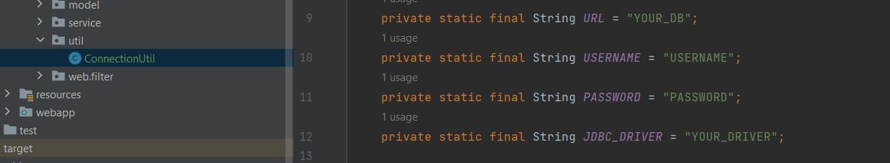


 

#  **Taxi service**

"Taxi Service" is a web application based on the knowledge of Java Core, JDBC, MySQL and Web technologies.

##  **General info**

This project allows you to do main CRUD operations, create, 
authenticate and authorize a new driver, 
add car and manufacturer to the Data Base.
It will help you control your drivers and cars.
This project have ability to display all cars connected 
to driver, also you can add/remove/display all drivers, cars, manufacturers.

##  **Technologies**

* Java 11
* MySQL
* Servlet API
* JSP technology
* JSTL
* Tomcat 9.0.50

##  **Project Structure**
Was used N-Tier architecture
* Presentation layer
* Service Layer
* DAO layer

### **DB schema:**

##  **Setup and run**

1. To run this application please install:
   * [IntelliJ IDEA Ultimate](https://www.jetbrains.com/lp/intellij-frameworks/)
   * [MySQL 8.0.32](https://www.softportal.com/software-65-mysql.html)
   * [Tomcat 9.0.50](https://archive.apache.org/dist/tomcat/tomcat-9/v9.0.50/bin/)
2. Clone the project from GitHub.
3. Create DB using local MySQL or remote database. You can find schema in init_db.sql file.
4. Put our DB URL, username, password, and JDBC driver to [ConnectionUtil.class](https://github.com/sanya-1xx8/taxi-service/blob/main/src/main/java/taxi/util/ConnectionUtil.java).

5. Add Tomcat 9.0.50 configuration.
